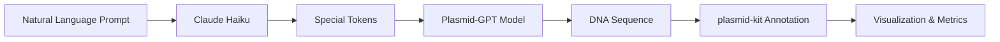

# Plasmid-GPT: AI-Powered Plasmid Design 🧬

Generate custom plasmids using natural language! This demo showcases the capabilities of Plasmid-GPT models (244M and 319M parameters) trained to generate synthetic plasmid sequences.

## Features

### 🗣️ Natural Language Input
Describe your desired plasmid in plain English. No need to know the technical tokens!

**Example prompts:**
- "I need a high copy number expression plasmid with a T7 promoter for E. coli"
- "Design a low copy number cloning vector with ampicillin resistance"
- "Create a shuttle vector for both bacteria and yeast"

### 🤖 AI-Powered Translation
Uses Claude Haiku to intelligently convert your description into the special tokens that condition the plasmid generation model.

### 🧬 DNA Generation
Two model sizes available:
- **244M parameters**: Fast inference, great for quick iterations
- **319M parameters**: Larger model, potentially more accurate

### 📊 Automatic Analysis
- **GC Content**: Calculates and categorizes (Low <40%, Medium 40-55%, High >55%)
- **Copy Number Estimation**: Based on sequence features
- **Sequence Length**: Total base pairs generated

### 🎨 Visualization
Beautiful circular plasmid maps inspired by [pLannotate](http://plannotate.barricklab.org/), showing:
- Circular plasmid representation
- Annotated features (promoters, resistance genes, origins, etc.)
- Interactive visualization with Plotly

### 🔍 Annotation
Powered by [plasmid-kit](https://github.com/McClain-Thiel/plasmid-kit), the app automatically identifies and annotates functional elements in your generated plasmid.

## How It Works



1. **Natural Language Processing**: Your prompt is sent to Claude Haiku, which converts it to special tokens that the model understands
2. **Conditional Generation**: Plasmid-GPT generates a DNA sequence conditioned on these special tokens
3. **Annotation**: The sequence is analyzed using plasmid-kit to identify functional elements
4. **Visualization**: A circular plasmid map is created showing all annotated features
5. **Metrics**: Key metrics like GC content and copy number are calculated

## Models

- **McClain/plasmid-gpt-244m**: Smaller, faster model
- **McClain/plasmid-gpt-319m**: Larger model with more parameters

Both models are trained on engineered plasmid sequences and can generate novel plasmid designs based on your specifications.

## Setup

To run this space locally:

```bash
git clone https://huggingface.co/spaces/McClain/plasmid-gpt-demo
cd plasmid-gpt-demo
pip install -r requirements.txt

# Set your Anthropic API key
export ANTHROPIC_API_KEY="your-api-key-here"

python app.py
```

## Environment Variables

- `ANTHROPIC_API_KEY`: Required for natural language to token conversion using Claude Haiku

## Citation

If you use Plasmid-GPT in your research, please cite:

```bibtex
@software{plasmid-gpt-2026,
  author = {McClain Thiel},
  title = {Plasmid-GPT: Generative Models for Plasmid Design},
  year = {2026},
  url = {https://huggingface.co/McClain/plasmid-gpt-244m}
}
```

## Related Projects

- [pLannotate](https://github.com/mmcguffi/pLannotate): Plasmid annotation tool
- [plasmid-kit](https://github.com/McClain-Thiel/plasmid-kit): Python library for plasmid analysis

## License

MIT License - See LICENSE file for details
# plasmid-space
